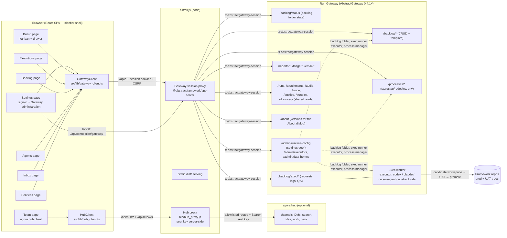
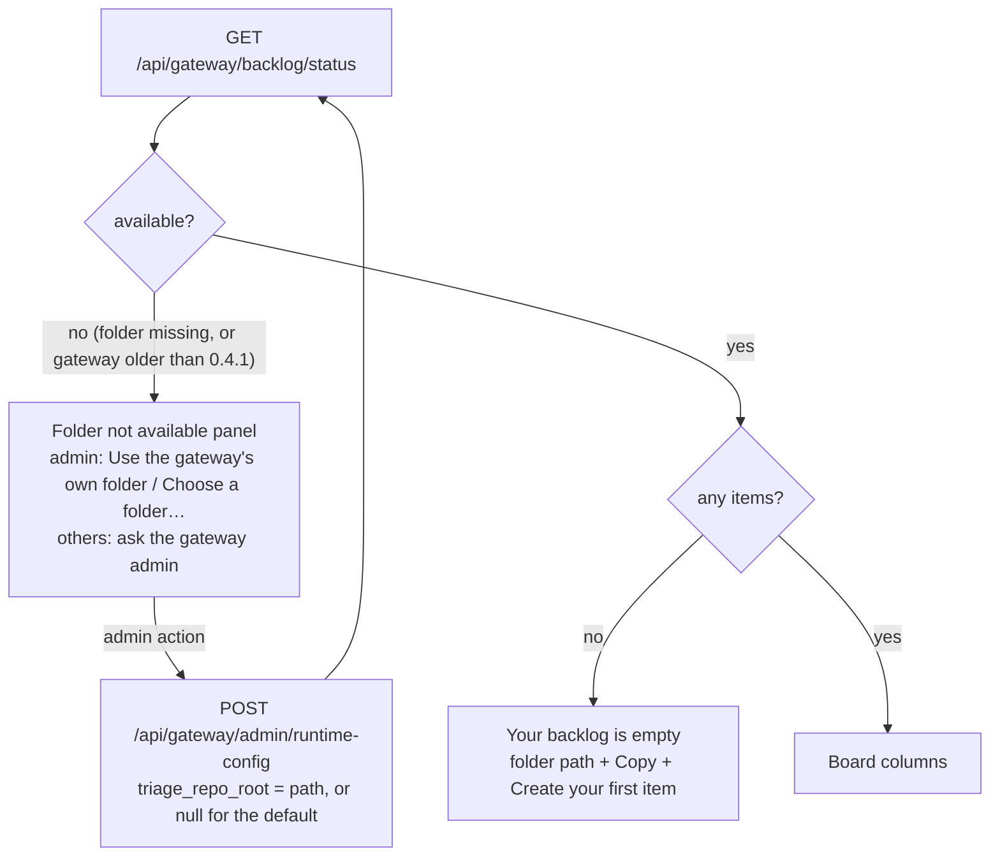

# Architecture

AbstractContinuum is a thin browser client over the Run Gateway's
development-lane APIs. It holds no durable state of its own: the gateway
owns the backlog files, exec requests, reports, email access, and managed
processes; the app renders them and issues commands.

## System shape



One transport mode: same-origin. The browser talks only to the app
server (`bin/cli.js` in production, the equivalent vite plugin in dev).
The session proxy signs in against the gateway, holds the session
server-side, sets first-party cookies, and enforces CSRF on mutating
requests. Tokens never reach browser storage. Every gateway path is reached
as `/api/gateway/<path>` (for example `GET /api/gateway/backlog/status`).
With `@abstractframework/app-server` 0.1.10 or newer, every request the proxy
sends to the gateway also carries the browser's connection address
(`X-Forwarded-For`) and the marker
`X-AbstractFramework-App-Proxy: abstractcontinuum`; see
[security.md](security.md#defense-layers).
The Team page uses the same
origin: `/api/hub/*` and the `/api/hub/ws` WebSocket are served by the hub
proxy, which attaches the operator seat's key server-side.

## Gateway settings and the backlog folder

The gateway, not this app, owns the settings that decide which pages have
data: the backlog folder (`triage_repo_root`), the exec runner
(`backlog_exec_runner`), the `executor`, and the `process_manager`. They have
three doors, all writing the same gateway setting: the gateway console
(Apps → *Backlog settings*), `abstractgateway config get|set` on the
gateway's computer, and this app's **Settings → Gateway administration**
(`GET`/`POST /admin/runtime-config`, admin only). Each value carries its
source (launch flag, setting, environment (legacy), or default), which
Settings renders as a pill.

The Board, Backlog and Executions pages read `GET /backlog/status` to decide
what to show:



A fresh gateway keeps its own backlog folder (`<gateway data dir>/backlog/`,
created with a starter overview and item template on first use), so a new
install lands on the empty state, never on the unavailable panel.

## The execution pipeline

The heart of the app is the exec pipeline. One request moves through:

```mermaid
stateDiagram-v2
    [*] --> queued: execute (item or batch)
    queued --> running: worker picks up
    running --> awaiting_qa: success (BOTH modes — human decision required)
    running --> failed: error / non-zero exit
    awaiting_qa --> running: Iterate (send feedback)
    awaiting_qa --> promoted: Approve (UAT — promote to prod;<br/>inplace — finalize: prod already mutated)
    awaiting_qa --> awaiting_qa: Restart UAT (deploy candidate)
    promoted --> [*]
    failed --> [*]
```



Success always parks at `awaiting_qa` — inplace mode does NOT bypass the
human decision; its Approve merely finalizes a request whose changes are
already in prod (the QA panel says so explicitly). A `completed` status
survives in the filters for legacy requests but no current gateway path
produces it.

The **Executions page** pins `use_exec_pipeline` to the live view: it
polls active requests (2s), follows the selected request's log tail while
it runs, and exposes the QA actions directly. The **Board** and the
**Backlog page** use the same hook to execute items and to mark planned
items that already have a live request (their **Execute** button reads
*Processing…*).

### Executor agnosticism

The executing agent is a deliberate seam, not a hardcoded dependency. The
gateway's `executor` setting chooses it from the registry that
`/admin/executors` reports (`codex`, `claude`, `cursor-agent`,
`abstractcode`, each with whether it is installed), and
`/backlog/exec/config` names the active executor for the UI to render. Keep
new UI copy executor-neutral and read identity from the config.

## Module layout

```text
src/
  app.tsx                     shell: sidebar nav, uic connect modal, probe
  lib/
    gateway_client.ts         typed gateway client (dev-lane families only)
    gateway_types.ts          request/response types
    hub_client.ts             agora hub client (via the /api/hub proxy)
    hub_api_types.ts          types generated from vendor/hub/openapi.json
    hub_contract.ts           compile-time pins against the hub contract
    hub_ledger.ts             independent hub ledger verification
    team_model.ts             Team page pure model (threads, filters, badges)
    work_id.ts                work-item id + rendered-state derivations
    entity_skills_model.ts    entity skills view model
    voice_settings.ts         per-browser voice overrides
    markdown_segments.ts      prose / mermaid splitting for rendering
    session_run_id.ts, ids.ts small id helpers
  ui/
    board/
      board_model.ts          metadata convention + DoR + column derivation (pure, pinned)
      use_board_data.ts       list/request fetches + lazy metadata cache
      use_work_claims.ts      hub work-claim rows joined onto board cards
      board_page.tsx          kanban columns/cards/filters + execute gate
      work_item_drawer.tsx    Spec / Runs / Review tabs
      work_activity_panel.tsx hub work activity for hub-backed cards
    backlog/
      model.ts                pure helpers (unit-pinned)
      hooks.ts                small shared hooks (media query, executor registry)
      use_exec_pipeline.ts    exec pipeline state + polling
      backlog_page.tsx        catalog table + composition root
      exec_detail_pane.tsx    exec detail + QA panel
      exec_events_view.tsx    live log/events viewer
      execute_modals.tsx      execute / batch / merge confirms
      new_task_modal.tsx      creation flow (template, guided, assist)
      advisor_drawer.tsx      read-only backlog advisor (chat + voice)
    team_page.tsx             Team page (agora hub client)
    team_file_viewer.tsx      channel file viewer
    agents_page.tsx           executor roster, entities, track record
    entity_skills_panel.tsx   entity skills section
    executions_page.tsx       live pipeline ops view
    report_inbox.tsx          bug/feature reports + triage decisions
    email_inbox.tsx           email accounts/messages/send
    processes_page.tsx        managed process control + env vars (Services)
    settings_page.tsx         connection, execution defaults, AI + voice preferences, hub seat, Gateway administration
    voice_settings_panel.tsx  voice override controls
    exec_event.ts             exec-log event classification
    backlog_folder.tsx        backlog folder state panel (empty / not available + admin actions)
    memo_markdown.tsx, mermaid_block.tsx   markdown + mermaid rendering
    modal.tsx, multi_select.tsx, error_boundary.tsx   shared widgets
bin/cli.js                    static serve + session proxy + hub proxy mount + `config` command
bin/settings.js               server settings: flags, settings file, precedence, Settings route
bin/hub_proxy.js              allowlisted agora hub proxy (HTTP + WebSocket)
vendor/hub/                   vendored hub OpenAPI + golden conformance vectors
```

### The Board model

Columns derive from gateway state — no board-side storage:
Triage = proposed files, Ready = planned files not inside a live request,
In Progress / In Review = live exec requests (the busy set comes from the
gateway's batch-aware `active_items` expansion — the same source the
Backlog page uses), Done / Failed = recent terminal requests (attempts;
the completed-file archive lives on the Backlog page). Work-item metadata
(priority, labels — sprints are `sprint-N` labels) rides convention lines
in the spec markdown header (`> Priority: P1`, `> Labels: ui, sprint-29`);
see [conventions.md](conventions.md) for the grammar. The Definition of
Ready is checked twice: advisory chips on the client, and the gateway's
`dor=check` gate on execute, which refuses with `409` unless the operator
records an explicit override.

Design boundaries:

- **Purpose boundary** — the observer observes and discusses; continuum
  develops and deploys. Observation features do not grow here.
- **Concern boundary** — `model.ts`, `board_model.ts` and `team_model.ts`
  are pure (no React/network) and unit-pinned; hooks such as
  `use_exec_pipeline` each own one concern; panes are presentational.
- **Client boundary** — `gateway_client.ts` carries only the API families
  this app uses (see [api.md](api.md)); entity and bundle reads serve the
  Agents page and the advisor picker, and run-observation features (ledger
  streams, knowledge-graph queries) belong in the observer.

## Related

- [api.md](api.md) — the exact endpoint families consumed
- [configuration.md](configuration.md) — launch flags, settings file, gateway settings
- [security.md](security.md) — trust model (process manager is high trust)
- [conventions.md](conventions.md) — the work-item grammar the Board parses
- [backlog/overview.md](backlog/overview.md) — work planning and history
- `history.md` (repo root) — provenance of the 2026-07-12 split
- `vendor/hub/` — the hub contract the Team page is typed and tested against
